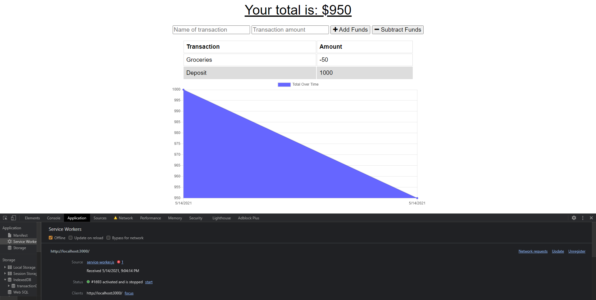

  # Budget Tracker Offline

  

    

  <!-- Titled description for grading clarity. Will remove after grading -->
  ## Description
  This project was assinged during the Georgia Tech Full Stack Flex Development Program. The aim of this project was to add additonal code to a pre-existing app in order to give it extra functionality, as well as enable offline usage. I believe I have accomplished this.
   

  

  
  
  ## Table of Contents
  1. [Description](#description)
  2. [Installation](#installation)
  3. [Usage](#usage)
  4. [License](#license)
  5. [ContactMe](#contactme)
  

  ## Installation
  No installation required.
   

  ## Usage
  To use this app, simply follow the link to the deployed app here: https://boiling-reaches-45767.herokuapp.com/
   

  ## License
  Link at: https://opensource.org/licenses/MIT
   
  License information: Copyright 2021 

    Permission is hereby granted, free of charge, to any person obtaining a copy of this software and associated documentation files (the "Software"), to deal in the Software without restriction, including without limitation the rights to use, copy, modify, merge, publish, distribute, sublicense, and/or sell copies of the Software, and to permit persons to whom the Software is furnished to do so, subject to the following conditions:
    
    The above copyright notice and this permission notice shall be included in all copies or substantial portions of the Software.
    
    THE SOFTWARE IS PROVIDED "AS IS", WITHOUT WARRANTY OF ANY KIND, EXPRESS OR IMPLIED, INCLUDING BUT NOT LIMITED TO THE WARRANTIES OF MERCHANTABILITY, FITNESS FOR A PARTICULAR PURPOSE AND NONINFRINGEMENT. IN NO EVENT SHALL THE AUTHORS OR COPYRIGHT HOLDERS BE LIABLE FOR ANY CLAIM, DAMAGES OR OTHER LIABILITY, WHETHER IN AN ACTION OF CONTRACT, TORT OR OTHERWISE, ARISING FROM, OUT OF OR IN CONNECTION WITH THE SOFTWARE OR THE USE OR OTHER DEALINGS IN THE SOFTWARE.
    
    

   

  ## Contributing

  
   

  ## Tests
  
   

  ## ContactMe
  Message me on Github at https://github.com/rstadev
   
  or email me at
   
   

